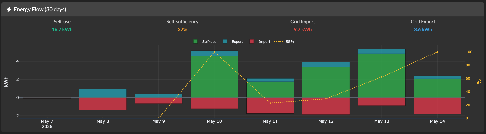
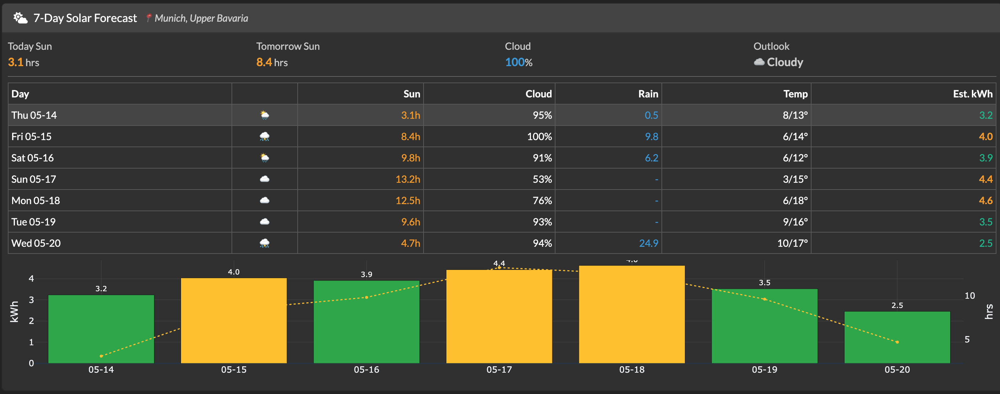

# Solar Load Controller

Automatically controls Anker Solarbank 2 E1600 AC home load (0–800 W) based on real-time IOMeter smart meter readings to minimize grid electricity usage.

## Features

- **Auto load control** — Reads the grid meter in real-time and adjusts the Solarbank home load to keep grid import near zero
- **Manual control** — Slider + buttons to manually set load (0–800 W in 10 W steps)
- **Real-time dashboard** — Solar production, battery SOC, meter reading, power flow visualisation
- **Load history** — 24 h chart of load changes vs meter readings
- **Daily energy summary** — Solar production, grid import/export, cost saved
- **All parameters tunable from UI** — No restart needed to change strategy settings

## Architecture

```
FastAPI (REST API + lifespan tasks)
  ├── IOMeter Service  →  polls local meter every 5 s
  ├── Anker Service    →  polls cloud API every 30 s, sets load
  ├── Strategy Engine  →  3-layer algorithm (spike detect → adjust → cooldown)
  └── Dash Dashboard   →  mounted at /dashboard, Bootstrap 5 dark theme
         └── SQLite    →  config, meter readings, load changes, profiles
```

## Motivation

This project was originally created to solve a very common pain point. After installing solar panels and the Anker Solix system, I realized that, like many other users, I did not have a smart meter installed — either because it wasn’t possible or due to cost considerations.

Without a smart meter, it becomes difficult to monitor and control power output and household loads in real time. Even when using smart plugs, they cannot effectively manage all devices in a home. For example, regular lighting or high-power appliances (like heating devices) are usually not connected to smart plugs, so they cannot be intelligently controlled.

To address this issue, I discovered a device called iometer, which can be easily integrated into a home environment. It also allows local access to its interface, making it very convenient to read real-time electricity usage data. Because of this, I highly recommend iometer as a solution for real-time energy monitoring.

Based on these considerations, I integrated these components into a system that enables real-time monitoring and automated control through a dashboard. This dashboard can be accessed both on a computer and on a mobile device.

In addition, in another project, I developed an ESP32-based real-time display terminal, which connects to the same web API to show live data.

Overall, this integrated solution is convenient, accurate, and practical for daily use. Anyone who is interested is welcome to download and try it out.

## Screenshots

### Live Dashboard

*Real-time view: solar production, battery SOC, grid reading, per-channel PV breakdown, power flow, and load control — all on one page.*

### Load Control & Strategy Selection

*Manual load slider (0–800 W) alongside the auto-control panel with 5 selectable strategies.*

### Live Grid Chart

*24-hour grid meter history. Spikes are appliance events; the strategy keeps the baseline near zero.*

### Strategy Configuration

*All control parameters tunable live from the UI — no restart required.*

### Analytics — Load vs Grid Balance

*Overlay of Solarbank load output and grid meter over time, with colour-coded import/export zones and self-sufficiency stats.*

### Analytics — Daily Energy Flow

*Multi-day view of solar self-use, grid import/export and self-sufficiency percentage.*

### Analytics — Energy Flow (30 days)

*30-day stacked bar chart: self-use, grid export, and grid import at a glance.*

### Analytics — Daily Detail Table

*Per-day breakdown of solar production, home consumption, import, export, electricity cost and savings.*

### Analytics — Hourly Pattern (7-day avg)

*Average grid usage by hour of day over 7 days — useful for spotting recurring load patterns.*

### Solar Forecast (7-day)

*7-day solar yield forecast (Open-Meteo) with estimated kWh output, sun hours, cloud cover and temperature.*

### Forecast vs Actual Solar

*Comparison of forecast vs actual solar production with over/under-estimation tracking.*

## Quick Start

### 1. Configure credentials

```bash
cp .env.example .env
# Edit .env with your Anker credentials and IOMeter IP
```

### 2. Run with Docker

```bash
docker compose up -d
```

Open http://localhost:8000 (redirects to `/dashboard/`).

### 3. Run locally (development)

```bash
pip install -r requirements.txt
# Set environment variables or create .env
python -m app.main
```

## Strategy Algorithm

**Goal**: Keep grid meter reading ≈ 0 W. Prefer slight export over any import.

### Layer 1 — Spike Detection
- Maintains rolling 120 s window of meter readings
- New spike detected when grid import exceeds `grid_target + min_change_threshold`
- Spike is observed for up to `spike_observation_period` (default 90 s)
- Matched against appliance profiles:
  - **ignore** (e.g. microwave ≤ 120 s): no load change
  - **adjust** (e.g. oven > 3 min): triggers load increase

### Layer 2 — Load Adjustment
```
target_load = current_load + (meter_reading − grid_target)
```
Clamped to [0, 800] W, rounded to 10 W steps. Only applied if change > `min_change_threshold`.

### Layer 3 — Cooldown
- `cooldown_period` (default 45 s) after each change prevents oscillation
- Emergency threshold (default 500 W) overrides cooldown for large spikes

## Configuration

All parameters are editable from the dashboard UI under **Strategy Configuration**:

| Parameter | Default | Description |
|-----------|---------|-------------|
| `polling_interval_s` | 5 | IOMeter read frequency |
| `reaction_delay_s` | 15 | Wait before first adjustment |
| `spike_observation_period_s` | 90 | Observation window |
| `cooldown_period_s` | 45 | Post-change cooldown |
| `min_change_threshold_w` | 30 | Hysteresis |
| `emergency_threshold_w` | 500 | Override cooldown threshold |
| `grid_target_w` | −10 | Target meter reading |
| `max_load_w` | 800 | Maximum allowed load |
| `electricity_price_eur_kwh` | 0.28 | For cost calculation |

## API Endpoints

| Method | Path | Description |
|--------|------|-------------|
| GET | `/api/data` | Combined dashboard snapshot |
| GET | `/api/status` | System health |
| POST | `/api/set-load` | Manual load control `{"load": 400}` |
| POST | `/api/auto-mode?enabled=true` | Toggle auto mode |
| GET/POST | `/api/config` | Read/write strategy parameters |
| GET/POST/DELETE | `/api/profiles` | Manage appliance profiles |
| GET | `/api/load-history` | Load change log |
| GET | `/api/meter-history` | Meter reading history |
| GET | `/api/power-events` | Detected power events |
| GET | `/api/daily-energy` | Daily energy summary |
| GET | `/health` | Health check |

## Deployment

Designed for a local Mac Mini with Docker. Uses `network_mode: host` so the container can reach the IOMeter device on the local network.

```bash
docker compose up -d --build
```

Data (SQLite + auth cache) persists in the `solar-data` Docker volume.

## Acknowledgements

The Anker Solix cloud API client (`app/api/`) is adapted from the reverse-engineering work by [Thomas Luther](https://github.com/thomluther/ha-anker-solix). Without that foundational work this project would not be possible. His project is also MIT-licensed — if you find this useful, consider starring his repository too.

## License

MIT — see [LICENSE](LICENSE).
